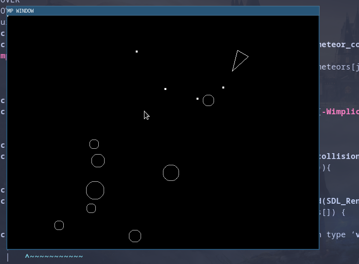
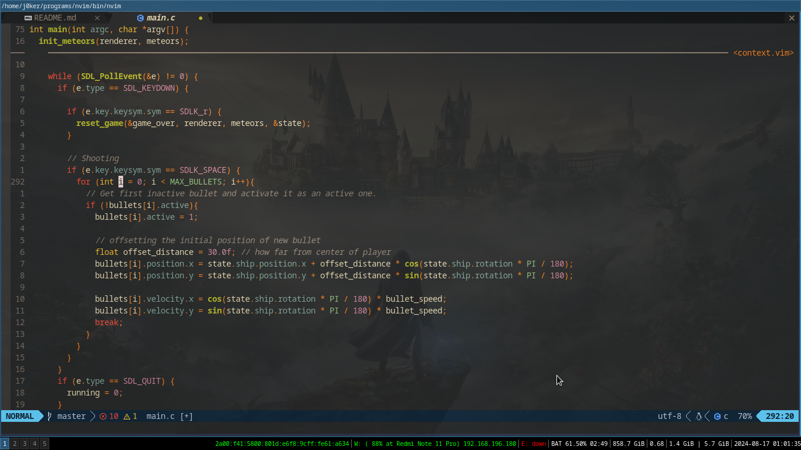
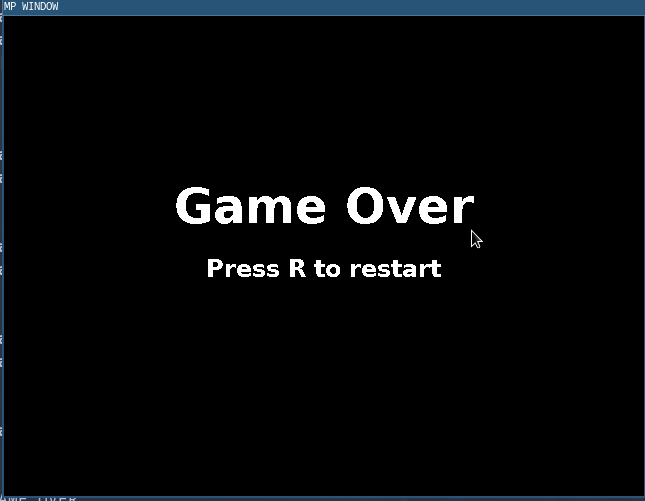

# Definitely not asteroids

## Abstract

I was just curious about implementing asteroids' movement in C with SDL.
I was also mega curious about i3 environment, because I just started to using that.
So to be actually true, I have to mention that I really really wanted to test my old laptop environment, with:
- i3
- my own ultimate customized neovim B)
- zsh
- alacritty
- picom
- tmux

## Used technologies

- C
- SDL2 (https://www.libsdl.org/)

## Disclaimer

There are more than a few things that I want to improve/change but for now it is what it is. It was funny couple of hours. **It is only proof of concept.** Maybe someday...

## Screens

